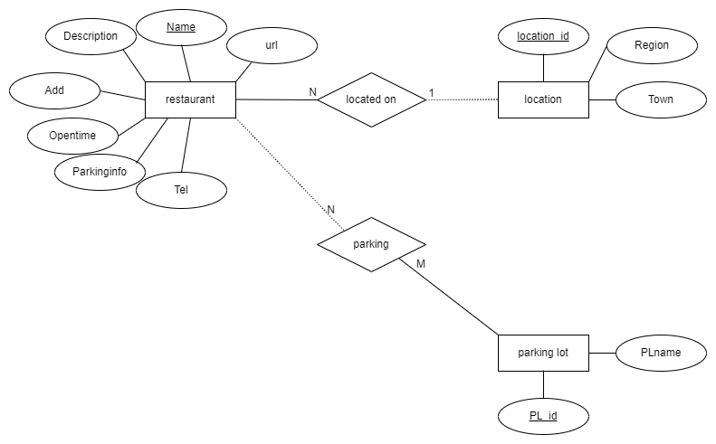
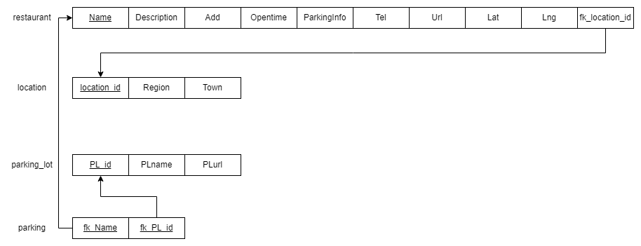
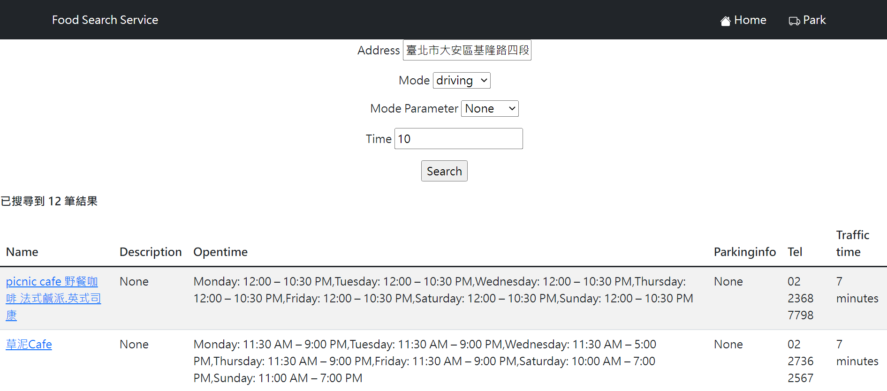
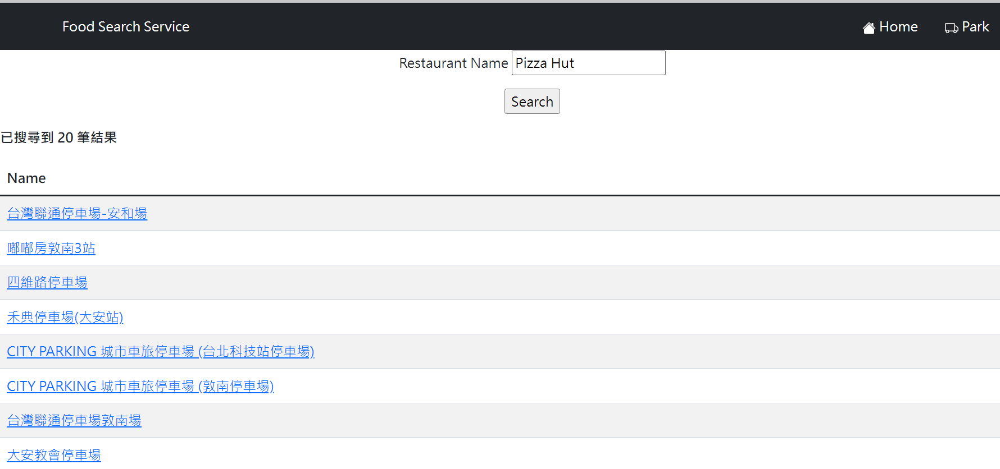

# restaurant-finder-TW

## Brief Introduction
>A simplified Google Map that considers traffic costs based on current location and provides more appropriate search functions.

>Different from the past, which only displayed the distance, it has been changed to use a more intuitive traffic time.
---
## System Component

 - Frontend : HTML, CSS, Bootstrap
 - Backend : Flask, sqlAlchemy
 - Database : google cloud sql (postgreSQL)
 - Service : google map API (Distance Matrix API, Places API)
---
## Prerequisite
#### **1. Prepare Python Environment**

Create a virtual environment : 
    
    python -m venv <environment path>

Download library : 

    pip install -r requirement.txt
 

#### **2. Create google cloud sql instances**

Read [Reference 1](https://github.com/Manders-Ma/restaurant-finder-TW#reference), Section : Create and manage---instances.

 

#### **3. Setup google map API**

1. Distance Matrix API -> Read [Reference 2](https://github.com/Manders-Ma/restaurant-finder-TW#reference), Section : setup.

2. Places API -> Read [Reference 3](https://github.com/Manders-Ma/restaurant-finder-TW#reference), Section : setup.

#### **4. Update ./hunter/config.py**
1. set apiKey_file_path
2. set GOOGLE_APPLICATION_CREDENTIALS key file(json)
3. set database connection information (user, password, db, etc.)

 

#### **5. Create table and import data for database**

>You can use goole cloud sql interface to import data.Or use pgAdmin ([video reference](https://www.youtube.com/watch?v=SPvA858VnX0&ab_channel=RandomCodingDood))

1. Run "./hunter/connectDB.py" to create all the table what you need.

2. import "./dataset/location.csv" for location table.
3. import "./dataset/restaurant.csv" and "./dataset/TaipeiRest.csv" to restaurant table.

4. Run "Preprocessing.py" to preprocess data and get park data(If you don't have park data).

---
## Reference
1. [Use python to connect cloud sql (postgreSQL)](https://cloud.google.com/sql/docs/postgres/connect-connectors?hl=zh-tw)
2. [Distance API document](https://developers.google.com/maps/documentation/distance-matrix)
3. [Place AP document](https://developers.google.com/maps/documentation/places/web-service)

## ER diagram

## Relational schema diagram

## Example

