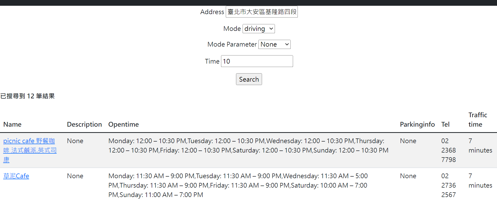
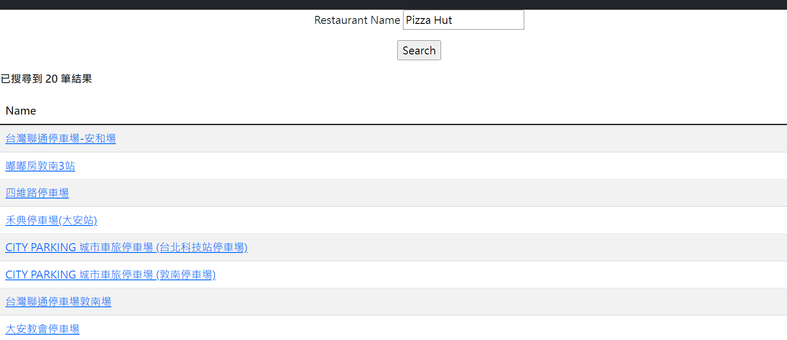

# FoodSearchService-TW

## Brief Introduction
- A simplified google map that considers traffic costs based on current location and provides more appropriate search functions.
- Different from the past that only displayed the distance, it is changed to use a more intuitive traffic time.

## ER diagram

## Relational schema diagram

## Example

